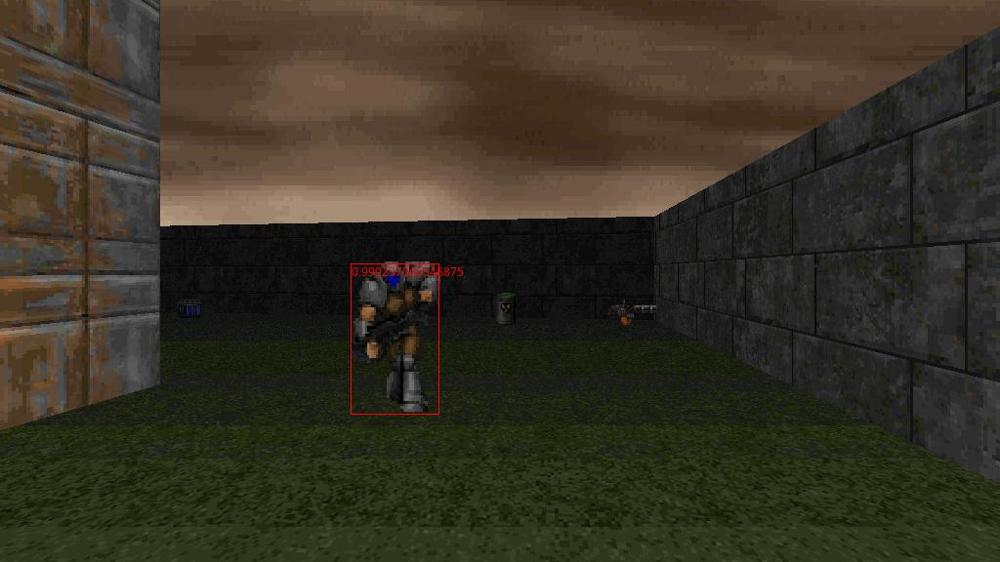

ViZDoomDetection
==========
This repository is for object detection for ViZDoom.

## Requirement
- Ubuntu
- Python 3.6
- Tensorflow>=1.12


## Demo Preview

`python demo.py`

The script will take `images/1.jpg` as input and output the result to `images/1_prediction.jpg`. The result is as below:



## More Details
 To be announced.
 
## Cite Us
If you use this repository in your research or wish to refer to the examples, please cite with:
```
@inproceedings{huang2019combo,
  title={Combo-Action: Training Agent For FPS Game with Auxiliary Tasks},
  author={Huang, Shiyu and Su, Hang and Zhu, Jun and Chen, Ting},
  year={2019},
  organization={AAAI}
}
```